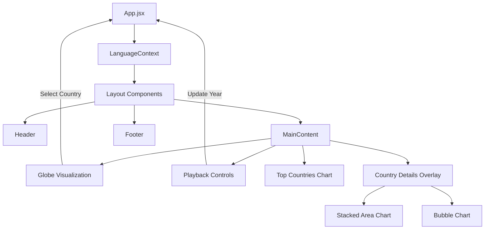

# Architecture Documentation

This document describes the architectural principles and structure of the **Global CO₂ Emissions Visualization** project.

## 🏗️ Architectural Pattern

The application follows a **Clean Architecture** approach adapted for a Frontend-only React application, organizing code into layers to separate concerns and improve maintainability.

### 1. Domain Layer (Data & Entities)
Located in `public/data/` and `src/services/`.
- **Responsibilities**: Defining the data structure, fetching raw data, and providing core business logic.
- **Components**:
  - **Data Source**: CSV files from the Global Carbon Budget (stored in `public/data/`).
  - **Service**: `countryService.js` handles external data fetching (translations) and local caching.
  - **Manifest**: `manifest.json` maps logical data keys to specific versioned files.

### 2. Application Layer (Logic & State)
Located in `src/hooks/` and `src/context/`.
- **Responsibilities**: Managing application state, data processing, and business rules.
- **Components**:
  - **`useData.js`**: Custom hook for fetching, parsing, and validating CSV data. It handles the "loading", "error", and "success" states.
  - **`LanguageContext.jsx`**: Global state management for internationalization (English/French).
  - **`App.jsx`**: The main orchestrator that integrates hooks and passes data to the Presentation layer.

### 3. Presentation Layer (UI & Visualization)
Located in `src/components/`.
- **Responsibilities**: Rendering the user interface and visualizations based on data props.
- **Components**:
  - **Globe**: 3D interactive visualization using `d3-geo`.
  - **Charts**: Reusable D3.js charts (`CountryChart`, `TopCountriesChart`, `StackedAreaChart`).
  - **Controls**: User input components (`Controls`, `Header`, `Footer`).
  - **Overlays**: Detailed views (`CountryDetailsOverlay`) dependent on selection state.

### 4. Infrastructure Layer (Build & Deployment)
Located in `scripts/`, `vite.config.js`, and `.github/`.
- **Responsibilities**: Building the application, deploying artifacts, and automating data updates.
- **Components**:
  - **Build System**: Vite + Tailwind CSS.
  - **Scripts**: `update-data.js` for fetching and processing new datasets.
  - **CI/CD**: GitHub Actions for linting, verification, and data updates.

## 🧩 Component Hierarchy

## 🔄 Data Flow

1.  **Initialization**:
    -   `App.jsx` mounts.
    -   `useData` hook requests `manifest.json`.
    -   `useData` fetches the CSV files specified in the manifest.
    -   Data is parsed (via D3), validated, and processed (grouped by year, calculated totals).

2.  **Interaction**:
    -   **Time Travel**: User moves the slider -> `year` state updates -> Charts re-render with filtered data for that year.
    -   **Selection**: User clicks a country -> `selectedCountry` state updates -> `CountryDetailsOverlay` opens -> `countryService` fetches details.

3.  **Visualization Updates**:
    -   Components like `Globe` and `TopCountriesChart` use `useEffect` to trigger D3 transitions when data props change, ensuring smooth animations outside the standard React render cycle.

## 🛠️ Extending the Application

### Adding a New Visualization
1.  **Create Component**: Add a new file in `src/components/charts/`.
2.  **Implement D3 Logic**: Use a `useRef` for the SVG container and `useEffect` for D3 drawing logic.
3.  **Optimize**: Wrap in `React.memo` if it receives frequent updates (like `year`).
4.  **Integrate**: Import and render in `App.jsx` or a relevant container.

### Adding a New Data Source
1.  **Update Script**: Modify `scripts/update-data.js` to fetch and process the new dataset.
2.  **Update Manifest**: Ensure the new file is generated and referenced in `manifest.json`.
3.  **Consume Data**: Update `useData.js` to load the new file.
4.  **Visualize**: Pass the new data to components.

## 🔒 Security Considerations

-   **Data Validation**: All incoming data (CSV, JSON) is validated before use.
-   **Content Security Policy (CSP)**: Strict headers are enforced to prevent XSS.
-   **Dependency Review**: Automated checks prevent malicious packages.
-   **Sanitization**: User inputs (even logical ones like country codes) are sanitized.

## 📉 Performance Optimizations

-   **Lazy Loading**: Heavy components (Globe, Charts) are lazy-loaded.
-   **Memoization**: `React.memo`, `useMemo`, and `useCallback` prevent unnecessary re-renders.
-   **D3 Optimization**: D3 manipulations often bypass React's virtual DOM for performance during animations.
-   **Data Structure**: Data is pre-processed into Maps for O(1) lookup during animation loops.
